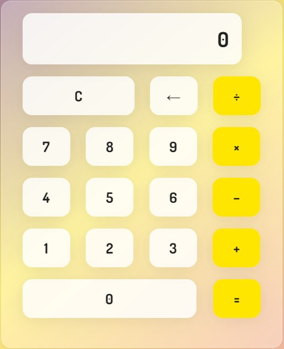

# CALCULADORA JAVASCRIPT
Les doy la bienvenida a mi mini-proyecto, en el cual desarrollé una calculadora con un aspecto moderno y bonito  

Usando las tecnologias basicas para diseño web, osea:  

• HTML 5  
• CSS 3  
• JAVASCRIPT  

